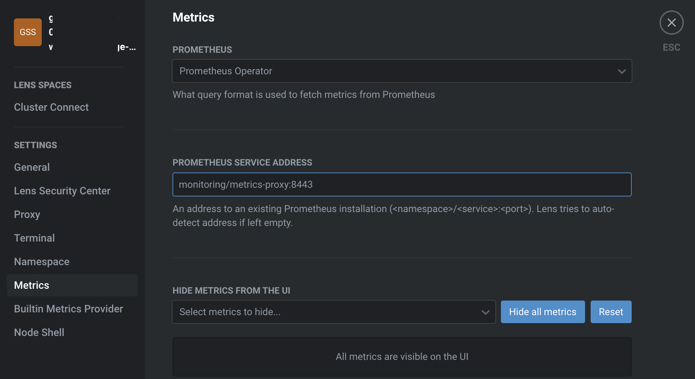

# Deployment

This guide is assuming you have [Workload Identity](https://cloud.google.com/kubernetes-engine/docs/how-to/workload-identity) enabled on your cluster.  
If not, other methods supported by [Google Auth Library](https://github.com/googleapis/google-auth-library-nodejs) may be available.  
In addition, environment variables `GOOGLE_ACCESS_TOKEN` and `GOOGLE_PROJECT_ID` can be set manually.

## 1. Create a google service account that has access to Monitoring.

To do this you can follow the guide at [Configure a query interface](https://cloud.google.com/stackdriver/docs/managed-prometheus/query#create-bind-sa) (note that this is using and modifying the default service account), or use the following sample [terraform](https://www.terraform.io) configuration using the [GCP provider](https://registry.terraform.io/providers/hashicorp/google/latest/docs):

```terraform
# Service account for accessing managed prometheus metrics
resource "google_service_account" "metrics_reader" {
  account_id   = "metrics-reader"
  display_name = "A service account for accessing managed prometheus metrics"
}

# We give it the role of monitoring.viewer
resource "google_project_iam_member" "monitoring_viewer_metrics_reader" {
  project = "CHANGE_ME"
  role    = "roles/monitoring.viewer"
  member  = "serviceAccount:${google_service_account.metrics_reader.email}"
}

# And allow the KSA `metrics-reader` account to authenticate as `metrics-reader` GSA
# through Workload Identity.
# Assuming namespace "monitoring".
resource "google_service_account_iam_member" "metrics_reader_workload_identity" {
  service_account_id = google_service_account.metrics_reader.name
  role               = "roles/iam.workloadIdentityUser"
  member             = "serviceAccount:${google_container_cluster.CHANGE_ME.workload_identity_config[0].workload_pool}[monitoring/metrics-reader]"
}
```

## 2. Create and bind a k8s service account

Apply the following yaml:
```yaml
apiVersion: v1
automountServiceAccountToken: true
kind: ServiceAccount
metadata:
  name: metrics-reader
  namespace: monitoring
  annotations:
    iam.gke.io/gcp-service-account: metrics-reader@PROJECT_ID_CHANGE_ME.iam.gserviceaccount.com
  labels:
    app: metrics-proxy
```

to create a k8s service account and bind it.

## 3. Deploy the metrics proxy

You can use the following yaml as an example:

```yaml
apiVersion: v1
kind: Namespace
metadata:
  name: monitoring
---
apiVersion: apps/v1
kind: Deployment
metadata:
  name: metrics-proxy
  namespace: monitoring
  labels:
    app: metrics-proxy
spec:
  replicas: 1
  selector:
    matchLabels:
      app: metrics-proxy
  template:
    metadata:
      labels:
        app: metrics-proxy
    spec:
      serviceAccountName: metrics-reader
      containers:
        - name: app
          image: miraries/gke-gmp-lens-metrics-proxy:0.1.0
          ports:
            - containerPort: 8443
---
apiVersion: v1
kind: Service
metadata:
  labels:
    app: metrics-proxy
  name: metrics-proxy
  namespace: monitoring
spec:
  selector:
    app: metrics-proxy
  ports:
    - name: http-port
      protocol: TCP
      port: 8443
      targetPort: 8443
```

## 4. Point Lens to the deployment

Go to cluster settings:


Go to **Metrics**  
Under `Prometheus` select `Prometheus Operator`  
Under `Prometheus service address` enter `monitoring/metrics-proxy:8443` (or whatever namespace/service name you used)      



## 5. Done!

You should now see metrics:


